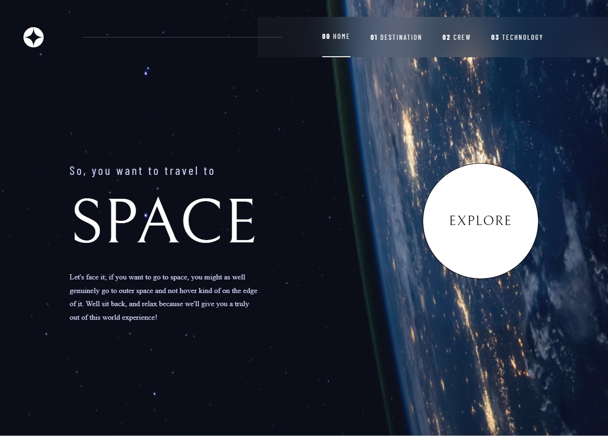

## 🤓 Frontend Mentor Challenge Solutions

This is a collection of all the solutions to the challenges of the Frontend Mentor program. In the subfolders you can find links to the online site, images and the description of the challenges.

## 🗃️ Project List [31]

 
<table  align="center"><tr><td>
  <picture> 
    
  </picture> 
     
  
  <h2 align="center">Multi-step form - server actions</h2>

  <h3 align="center"> 
  
  
  </h3>
  

    <a href="https://multi-step-form-cs.vercel.app/">Live</a> | <a href="https://github.com/leandrorodrigues00/frontend-mentor-challenges/tree/main/react-next-challenges/multi-step-form">Repo</a> | <a href="https://www.frontendmentor.io/challenges/multistep-form-YVAnSdqQBJ">Try Out</a>
  

  
   
    
</td></tr></table>

 
<table  align="center"><tr><td>
  <picture> 
    
  </picture> 
     
  
  <h2 align="center">Age calculator</h2>

  <h3 align="center"> 
  
  
  </h3>
  
  

    <a href="https://age-calculator-cs1.netlify.app/">Live</a> | <a href="https://github.com/leandrorodrigues00/frontend-mentor-challenges/tree/main/react-next-challenges/age-calculator">Repo</a> | <a href="https://www.frontendmentor.io/challenges/age-calculator-app-dF9DFFpj-Q">Try Out</a>
  

  
   
    
</td></tr></table>

 
<table  align="center"><tr><td>
  <picture> 
    
  </picture> 
     
  
  <h2 align="center">Blog Card</h2>

  <h3 align="center"> 
  
  
  </h3>
  
  

    <a href="https://blog-card-cs.netlify.app/">Live</a> | <a href="https://github.com/leandrorodrigues00/frontend-mentor-challenges/tree/main/react-next-challenges/blog-card">Repo</a> | <a href="https://www.frontendmentor.io/challenges/blog-preview-card-ckPaj01IcS">Try Out</a>
  

  
   
    
</td></tr></table>

 
<table  align="center"><tr><td>
  <picture> 
    
  </picture> 
     
  
  <h2 align="center">Todo app with drag and drop</h2>

  <h3 align="center"> 
  
  
  </h3>
  
  

    <a href="https://todo-app-main-cs.netlify.app/">Live</a> | <a href="https://github.com/leandrorodrigues00/frontend-mentor-challenges/tree/main/react-next-challenges/todo-app-main">Repo</a> | <a href="https://www.frontendmentor.io/challenges/todo-app-Su1_KokOW/hub">Try Out</a>
  

  
   
    
</td></tr></table>

 
<table  align="center"><tr><td>
  <picture> 
    
  </picture> 
     
  
  <h2 align="center">Job listings with filtering</h2>

  <h3 align="center"> 
  
  
  </h3>
  
  

    <a href="https://job-listings-with-filtering-cs.netlify.app/">Live</a> | <a href="https://github.com/leandrorodrigues00/frontend-mentor-challenges/tree/main/react-next-challenges/job-listings-with-filtering">Repo</a> | <a href="https://www.frontendmentor.io/challenges/job-listings-with-filtering-ivstIPCt">Try Out</a>
    
  

  
   
    
</td></tr></table>

 
<table  align="center"><tr><td>
  <picture> 
    
  </picture> 
     
  
  <h2 align="center">Interactive comments section</h2>

  <h3 align="center"> 
  
  
  </h3>
  

    <a href="https://interactive-comments-section-cs.netlify.app/">Live</a> | <a href="https://github.com/leandrorodrigues00/frontend-mentor-challenges/tree/main/react-next-challenges/interactive-comments-section">Repo</a> | <a href="https://www.frontendmentor.io/challenges/interactive-comments-section-iG1RugEG9">Try Out</a>
  

  
   
    
</td></tr></table>

 

 
<table  align="center"><tr><td>
  <picture> 
    
  </picture> 
     
  
  <h2 align="center">IP Address Tracker</h2>

  <h3 align="center"> 
  
  
  </h3>
  

    <a href="https://ip-address-tracker-cs.netlify.app/">Live</a> | <a href="https://github.com/leandrorodrigues00/frontend-mentor-challenges/tree/main/react-next-challenges/ip-address-tracker">Repo</a> | <a href="https://www.frontendmentor.io/challenges/ip-address-tracker-I8-0yYAH0">Try Out</a>
  

  
   
    
</td></tr></table>

 

 
<table  align="center"><tr><td>
  <picture> 
    
  </picture> 
     
  
  <h2 align="center">REST Countries API</h2>

  <h3 align="center"> 
  
  
  </h3>
  

    <a href="https://rest-countries-cs.netlify.app/">Live</a> | <a href="https://github.com/leandrorodrigues00/frontend-mentor-challenges/tree/main/react-next-challenges/rest-countries">Repo</a> | <a href="https://www.frontendmentor.io/challenges/rest-countries-api-with-color-theme-switcher-5cacc469fec04111f7b848ca">Try Out</a>
  

  
   
    
</td></tr></table>

 

 
<table  align="center"><tr><td>
  <picture> 
    
  </picture> 
     
  
  <h2 align="center">Space Tourism</h2>

  <h3 align="center"> 
  
  
  </h3>
  

    <a href="https://space-tourism-cs.netlify.app/">Live</a> | <a href="https://github.com/leandrorodrigues00/frontend-mentor-challenges/tree/main/react-next-challenges/space-tourism">Repo</a> | <a href="https://www.frontendmentor.io/challenges/space-tourism-multipage-website-gRWj1URZ3">Try Out</a>
  

  
   
    
</td></tr></table>

 
<table  align="center"><tr><td>
  <picture> 
    
  </picture> 
     
  
  <h2 align="center">FAQ accordion card</h2>

  <h3 align="center"> 
  
  
  </h3>
  

    <a href="https://faq-accordion-cs.netlify.app/">Live</a> | <a href="https://github.com/leandrorodrigues00/frontend-mentor-challenges/tree/main/react-next-challenges/faq-accordion-card">Repo</a> | <a href="https://www.frontendmentor.io/challenges/faq-accordion-card-XlyjD0Oam">Try Out</a>
  

  
   
    
</td></tr></table>

 
<table  align="center"><tr><td>
  <picture> 
    
  </picture> 
     
  
  <h2 align="center">E-commerce product page</h2>

  <h3 align="center"> 
  
  
  </h3>
  

    <a href="https://ecommerce-product-page-cs.netlify.app/">Live</a> | <a href="https://github.com/leandrorodrigues00/frontend-mentor-challenges/tree/main/react-next-challenges/ecommerce-product-page">Repo</a> | <a href="https://www.frontendmentor.io/challenges/ecommerce-product-page-UPsZ9MJp6">Try Out</a>
  

  
   
    
</td></tr></table>

 
<table  align="center"><tr><td>
  <picture> 
    
  </picture> 
     
  
  <h2 align="center">Interactive card details</h2>

  <h3 align="center"> 
  
  
  </h3>
  

    <a href="https://interactive-card-details-cs.netlify.app/">Live</a> | <a href="https://github.com/leandrorodrigues00/frontend-mentor-challenges/tree/main/react-next-challenges/interactive-card-details">Repo</a> | <a href="https://www.frontendmentor.io/challenges/interactive-card-details-form-XpS8cKZDWw">Try Out</a>
  

  
   
    
</td></tr></table>

 
<table  align="center"><tr><td>
  <picture> 
    
  </picture> 
     
  
  <h2 align="center">Intro component with sign-up</h2>

  <h3 align="center"> 
  
  
  </h3>
  

    <a href="https://component-signup-cs.netlify.app/">Live</a> | <a href="https://github.com/leandrorodrigues00/frontend-mentor-challenges/tree/main/react-next-challenges/component-singup">Repo</a> | <a href="https://www.frontendmentor.io/challenges/intro-component-with-signup-form-5cf91bd49edda32581d28fd1">Try Out</a>
  

  
   
    
</td></tr></table>

 

<table  align="center"><tr><td>
  <picture>
    
  </picture>
  
     
  
  <h2 align="center">Product preview card component</h2>
 
  <h3 align="center"> 
  
  
  </h3>
  
  

    <a href="https://product-preview-cs.netlify.app/">Live</a> | <a href="https://github.com/leandrorodrigues00/frontend-mentor-challenges/tree/main/react-next-challenges/product-preview">Repo</a> | <a href="https://www.frontendmentor.io/challenges/product-preview-card-component-GO7UmttRfa">Try Out</a>
  

  
   
    
</td></tr></table>

 

<table  align="center"><tr><td>
  <picture> 
    
  </picture>
  
     
  
  <h2 align="center">Expenses chart component</h2>
 
  <h3 align="center"> 
  
  
  </h3>
  
  

    <a href="https://expenses-chart-cs.netlify.app/">Live</a> | <a href="https://github.com/leandrorodrigues00/frontend-mentor-challenges/tree/main/react-next-challenges/expenses-chart">Repo</a> | <a href="https://www.frontendmentor.io/challenges/expenses-chart-component-e7yJBUdjwt">Try Out</a>
  

  
   
    
</td></tr></table>

 

<table  align="center"><tr><td>
  <picture> 
    
  </picture>
  
     
  
  <h2 align="center">Notifications page</h2>
 
  <h3 align="center"> 
  
  
  </h3>
  
  

    <a href="https://notifications-page-cs.netlify.app/">Live</a> | <a href="https://github.com/leandrorodrigues00/frontend-mentor-challenges/tree/main/react-next-challenges/notifications-page">Repo</a> | <a href="https://www.frontendmentor.io/challenges/notifications-page-DqK5QAmKbC">Try Out</a>
  

  
   
    
</td></tr></table>

 

<table  align="center"><tr><td>
  <picture> 
    
  </picture>
  
     
  
  <h2 align="center">3-column preview card</h2>
 
  <h3 align="center"> 
  
  
  </h3>
  
  

    <a href="https://3-column-preview-card-cs.netlify.app/">Live</a> | <a href="https://github.com/leandrorodrigues00/frontend-mentor-challenges/tree/main/react-next-challenges/3-column-card">Repo</a> | <a href="https://www.frontendmentor.io/challenges/3column-preview-card-component-pH92eAR2">Try Out</a>
  

 
   
    
</td></tr></table>

 

<table  align="center"><tr><td>
  <picture>
    
  </picture>
  
     
  
  <h2 align="center">Ping single column coming soon</h2>
 
  <h3 align="center"> 
  
  
  </h3>
  
  

    <a href="https://ping-coming-soon-cs.netlify.app/">Live</a> | <a href="https://github.com/leandrorodrigues00/frontend-mentor-challenges/tree/main/react-next-challenges/ping-coming-soon-page">Repo</a> | <a href="https://www.frontendmentor.io/challenges/ping-single-column-coming-soon-page-5cadd051fec04111f7b848da">Try Out</a>
  

  
  
   
    
</td></tr></table>

 

<table  align="center"><tr><td>
  <picture>
    
  </picture>
  
     
  
  <h2 align="center">Easybank landing page</h2>
 
  <h3 align="center"> 
  
  
  </h3>
  
  

    <a href="https://easybank-landing-page-master-cs.netlify.app/">Live</a> | <a href="https://github.com/leandrorodrigues00/frontend-mentor-challenges/tree/main/react-next-challenges/easybank-landing-page-master">Repo</a> | <a href="https://www.frontendmentor.io/challenges/easybank-landing-page-WaUhkoDN">Try Out</a>
  

  
   
    
</td></tr></table>

   
  
<table  align="center"><tr><td>
  <picture>
    
  </picture>
  
     
  
  <h2 align="center">Tip calculator app</h2>
 
  <h3 align="center"> 
  
  
  </h3>
  
  

    <a href="https://tip-calculator-app-cs.netlify.app/">Live</a> | <a href="https://github.com/leandrorodrigues00/frontend-mentor-challenges/tree/main/react-next-challenges/tip-calculator-app">Repo</a> | <a href="https://www.frontendmentor.io/challenges/tip-calculator-app-ugJNGbJUX">Try Out</a>
  

  
   
    
</td></tr></table>

 

<table  align="center"><tr><td>
  <picture>
    
  </picture>
  
     
  
  <h2 align="center">Interactive rating component</h2>
 
  <h3 align="center"> 
  
  
  </h3>
  
  

    <a href="https://interactive-rating-component-cs.netlify.app/">Live</a> | <a href="https://github.com/leandrorodrigues00/frontend-mentor-challenges/tree/main/react-next-challenges/interactive-rating-component-main">Repo</a> | <a href="https://www.frontendmentor.io/challenges/interactive-rating-component-koxpeBUmI">Try Out</a>
  

  
   
    
</td></tr></table>

 

<table  align="center"><tr><td>
  <picture>
    
  </picture>
  
     
  
  <h2 align="center">Advice generator app</h2>
 
  <h3 align="center"> 
  
  
  </h3>
  
  

    <a href="https://api-advice-generator-cs.netlify.app/">Live</a> | <a href="https://github.com/leandrorodrigues00/frontend-mentor-challenges/tree/main/react-next-challenges/api-advice-generator-app-main">Repo</a> | <a href="https://www.frontendmentor.io/challenges/advice-generator-app-QdUG-13db">Try Out</a>
  

  
   
    
</td></tr></table>

 

<table  align="center"><tr><td>
  <picture>
    
  </picture>
  
     
  
  <h2 align="center">Time tracking dashboard</h2>
 
  <h3 align="center"> 
  
  
  </h3>
  
  

    <a href="https://time-tracking-dashboard-cs.netlify.app/">Live</a> | <a href="https://github.com/leandrorodrigues00/frontend-mentor-challenges/tree/main/react-next-challenges/time-tracking-dashboard-main">Repo</a> | <a href="https://www.frontendmentor.io/challenges/time-tracking-dashboard-UIQ7167Jw">Try Out</a>
  

  
   
    
</td></tr></table>

 

<table  align="center"><tr><td>
  <picture>
    
  </picture>
  
     
  
  <h2 align="center">Article preview </h2>
 
  <h3 align="center"> 
  
  
  </h3>
  
  

    <a href="https://article-preview-component-cs.netlify.app/">Live</a> | <a href="https://github.com/leandrorodrigues00/frontend-mentor-challenges/tree/main/react-next-challenges/article-preview-component-master">Repo</a> | <a href="https://www.frontendmentor.io/challenges/article-preview-component-dYBN_pYFT">Try Out</a>
  

  
   
    
</td></tr></table>

 

<table  align="center"><tr><td>
  <picture>
    
  </picture>
  
     
  
  <h2 align="center">Four card feature section</h2>
 
  <h3 align="center"> 
  
  
  </h3>
  
  

    <a href="https://four-card-feature-section-cs.netlify.app/">Live</a> | <a href="https://github.com/leandrorodrigues00/frontend-mentor-challenges/tree/main/react-next-challenges/four-card-feature-section-master">Repo</a> | <a href="https://www.frontendmentor.io/challenges/four-card-feature-section-weK1eFYK">Try Out</a>
  

  
   
    
</td></tr></table>

 

<table  align="center"><tr><td>
  <picture>
    
  </picture>
  
     
  
  <h2 align="center">Testimonials grid section</h2>
 
  <h3 align="center"> 
  
  
  </h3>
  
  

    <a href="https://testimonials-grid-section-cs.netlify.app/">Live</a> | <a href="https://github.com/leandrorodrigues00/frontend-mentor-challenges/tree/main/react-next-challenges/testimonials-grid-section-main">Repo</a> | <a href="https://www.frontendmentor.io/challenges/testimonials-grid-section-Nnw6J7Un7">Try Out</a>
  

  
   
    
</td></tr></table>

 

<table  align="center"><tr><td>
  <picture>
    
  </picture>
  
     
  
  <h2 align="center">Huddle landing page | introductory</h2>
 
  <h3 align="center"> 
  
  
  </h3>
  
  

    <a href="https://huddle-landing-page-cs.netlify.app/">Live</a> | <a href="https://github.com/leandrorodrigues00/frontend-mentor-challenges/tree/main/react-next-challenges/huddle-landing-page">Repo</a> | <a href="https://www.frontendmentor.io/challenges/huddle-landing-page-with-a-single-introductory-section-B_2Wvxgi0">Try Out</a>
  

  
   
    
</td></tr></table>

 

<table  align="center"><tr><td>
  <picture>
    
  </picture>
  
     
  
  <h2 align="center">Order summary component</h2>
 
  <h3 align="center"> 
  
  
  </h3>
  
  

    <a href="https://order-summary-component-cs.netlify.app/">Live</a> | <a href="https://github.com/leandrorodrigues00/frontend-mentor-challenges/tree/main/react-next-challenges/order-summary-component">Repo</a> | <a href="https://www.frontendmentor.io/challenges/order-summary-component-QlPmajDUj">Try Out</a>
  

  
   
    
</td></tr></table>

 

<table  align="center"><tr><td>
  <picture>
    
  </picture>
  
     
  
  <h2 align="center">NFT preview card component</h2>
 
  <h3 align="center"> 
  
  
  </h3>
  
  

    <a href="https://nft-preview-card-component-cs.netlify.app/">Live</a> | <a href="https://github.com/leandrorodrigues00/frontend-mentor-challenges/tree/main/react-next-challenges/nft-preview-card-component-main">Repo</a> | <a href="https://www.frontendmentor.io/challenges/nft-preview-card-component-SbdUL_w0U/">Try Out</a>
  

  
   
    
</td></tr></table>

 

<table  align="center"><tr><td>
  <picture>
    
  </picture>
  
     
  
  <h2 align="center">Stats preview card</h2>
 
  <h3 align="center"> 
  
  
  </h3>
  
  

    <a href="https://stats-preview-card-component-cs.netlify.app/">Live</a> | <a href="https://github.com/leandrorodrigues00/frontend-mentor-challenges/tree/main/react-next-challenges/stats-preview-card-component-main">Repo</a> | <a href="https://www.frontendmentor.io/challenges/stats-preview-card-component-8JqbgoU62">Try Out</a>
  

  
   
    
</td></tr></table>

 

<table  align="center"><tr><td>
  <picture>
    
  </picture>
  
     
  
  <h2 align="center">QR code component</h2>
 
  <h3 align="center"> 
  
  
  </h3>
  
  

    <a href="https://qr-code-component-cs.netlify.app/">Live</a> | <a href="https://github.com/leandrorodrigues00/frontend-mentor-challenges/tree/main/react-next-challenges/qr-code-component-main">Repo</a> | <a href="https://www.frontendmentor.io/challenges/qr-code-component-iux_sIO_H">Try Out</a>
  

  
   
    
</td></tr></table>

 
